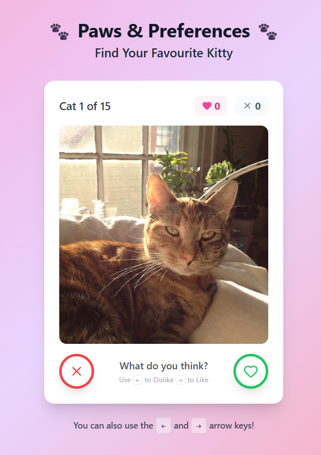
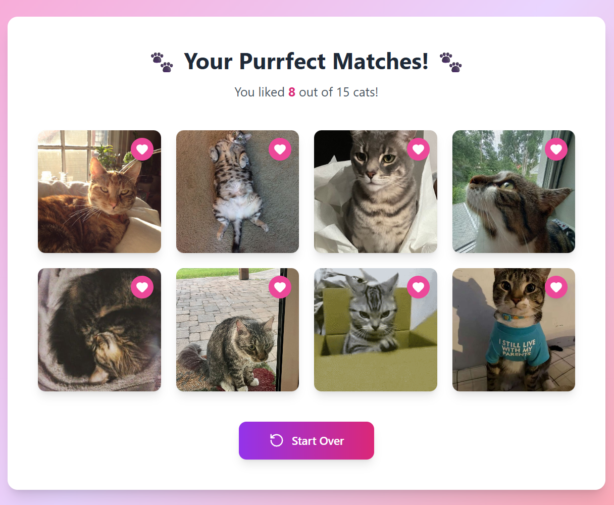

# 🐾 Paws & Preferences

A "Tinder for Cats" web application built with **React** and **Vite**. This project allows users to view a stack of cat images, swipe right to "like" or left to "pass," and view a summary of their favorite felines at the end.

## 🔗 Live Demo
**[View the Live Application Here](https://eric-ux99.github.io/Cat-Swiper/)**

## ✨ Key Features

* **Infinite Cuteness:** Fetches a random batch of cats from the [Cataas API](https://cataas.com/) every time the app starts.
* **Interactive Swiping:** "Like" or "Pass" functionality with visual feedback and animations.
* **Keyboard Navigation:** Full support for arrow keys (`←` to Pass, `→` to Like) for desktop accessibility.
* **Smart Preloading:** Implemented an aggressive image preloading strategy (buffers the next 3 images) to ensure zero latency/white flashes during swiping.
* **Responsive Design:** optimized for both mobile devices and desktop screens using **Tailwind CSS**.
* **Summary View:** Displays a grid grid of all "Liked" cats upon completion.

## 🛠️ Tech Stack

* **Framework:** React (Vite)
* **Styling:** Tailwind CSS
* **Icons:** Lucide React
* **API:** Cataas (Cat as a service)
* **Deployment:** GitHub Pages

## 💡 Technical Highlights

### 1. Image Preloading Strategy
To meet the requirement for a "smooth experience," I implemented a custom buffering system. Instead of loading images one by one, the app watches the `currentIndex` and automatically fetches the next 3 images in the background using the `new Image()` constructor. This ensures the next card is always ready in the browser cache before the user swipes.

### 2. Robust API Handling
The Cataas API occasionally returns objects without standard IDs or fixed sequences. I implemented:
* **Randomization:** A random `skip` parameter is generated on mount to ensure users don't see the same 15 cats every session.
* **Data Sanitization:** The fetch logic filters out corrupt data entries (missing IDs) before they reach the UI state to prevent broken image links.

### 3. Optimistic UI & Animations
CSS animations (`slide-right`, `slide-left`) are triggered via state changes to provide immediate visual feedback to the user, while the underlying data array is updated asynchronously.

